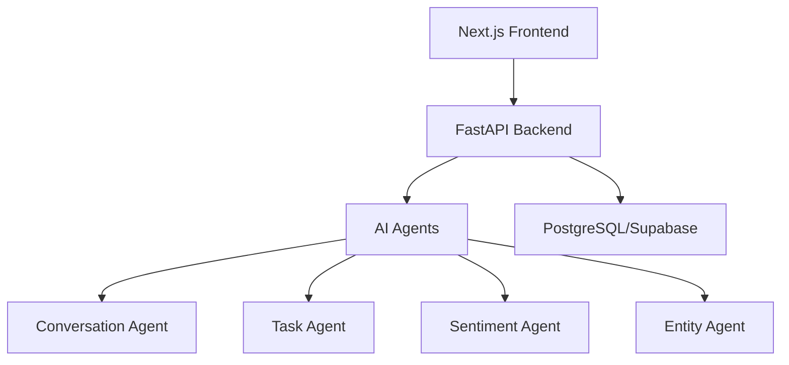

# NeuroNet AI

Multi-agent collaboration intelligence platform. Ingests exported team
communication data (Slack/GitHub/Jira/etc.) and turns it into searchable
knowledge and insights.

## Motivation

Engineering teams generate vast amounts of communication data across platforms.
NeuroNet AI extracts value from this data through AI agents that identify
decisions, tasks, sentiment, and entities without manual effort.

## Features

- ✅ **Import Engine**: Markdown, TXT, GitHub Issues, GitHub PRs
- ✅ **AI Agents**: Conversation, Task, Sentiment, Entity analysis
- ✅ **Workspace**: Project-centric AI analysis view
- ✅ **Dashboard**: Cross-project analytics and insights
- ✅ **AI Chat**: Natural language querying
- ✅ **Knowledge Graph**: Interactive entity relationships
- ✅ **Reports**: Multi-format export (PDF, Markdown, JSON)

## Technology Stack

| Layer | Technology |
|-------|-----------|
| Backend | Python 3.12, FastAPI, SQLAlchemy, PostgreSQL |
| AI | Custom rule-based agents (extensible to LangGraph) |
| Frontend | Next.js 15, React, TypeScript, Tailwind CSS |
| Auth | Supabase |
| Deploy | Docker, uv package manager |

## Architecture



## Folder Structure

```
backend/
  app/
    domain/          # Entities + Repository interfaces
    application/      # Use cases + AI Agents
    infrastructure/     # SQLAlchemy models, Repository impl
    api/              # FastAPI routes + Schemas
    shared/           # Config, logging, exceptions
  tests/

frontend/
  src/
    app/             # Next.js App Router pages
    components/      # 16 reusable UI components
    lib/api.ts       # Typed API client

sample-data/         # Example import files
```

## Installation

### 1. Database (Supabase)

Create a project at supabase.com and get your connection string.

### 2. Backend

```bash
cd backend
cp .env.example .env        # Add DATABASE_URL
uv venv
source .venv/bin/activate
uv sync --all-extras
uv run uvicorn app.main:app --reload
```

API docs: http://localhost:8000/docs

### 3. Frontend

```bash
cd frontend
cp .env.local.example .env.local
npm install
npm run dev
```

App: http://localhost:3000

## Environment Variables

### Backend (.env)
```
DATABASE_URL=postgresql://...
```

### Frontend (.env.local)
```
NEXT_PUBLIC_API_URL=http://localhost:8000
```

## API Endpoints

### Projects
```
POST   /api/v1/projects     Create project
GET    /api/v1/projects     List projects
GET    /api/v1/projects/{id} Get project
PATCH  /api/v1/projects/{id} Update project
DELETE /api/v1/projects/{id} Delete project
```

### Imports
```
POST   /api/v1/imports/markdown
POST   /api/v1/imports/txt
POST   /api/v1/imports/github-issue
POST   /api/v1/imports/github-pr
GET    /api/v1/imports/{job_id}
GET    /api/v1/imports
```

### Analysis
```
POST   /api/v1/analysis/{project_id}
GET    /api/v1/analysis/{project_id}
GET    /api/v1/analysis/{project_id}/tasks
GET    /api/v1/analysis/{project_id}/sentiment
GET    /api/v1/analysis/{project_id}/entities
```

### Health
```
GET    /api/v1/health
```

## Running with Docker

```bash
docker compose up
```

## Testing

```bash
# Backend
cd backend
uv run pytest

# Frontend
cd frontend
npm run lint
npm run build
```

## Screenshots

| Dashboard | Workspace | Chat |
|-----------|-----------|------|
| Analytics overview across projects | Task board with sentiment | AI-powered Q&A |

## Future Roadmap

- [ ] LangGraph integration for advanced workflows
- [ ] Real-time streaming updates
- [ ] Slack export support
- [ ] Jira integration
- [ ] Notion import
- [ ] Vector embeddings for semantic search

## License

MIT License - see LICENSE file